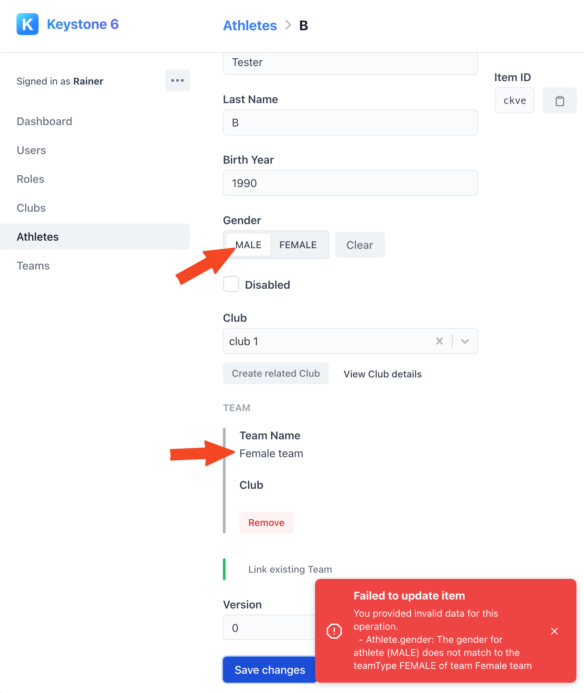
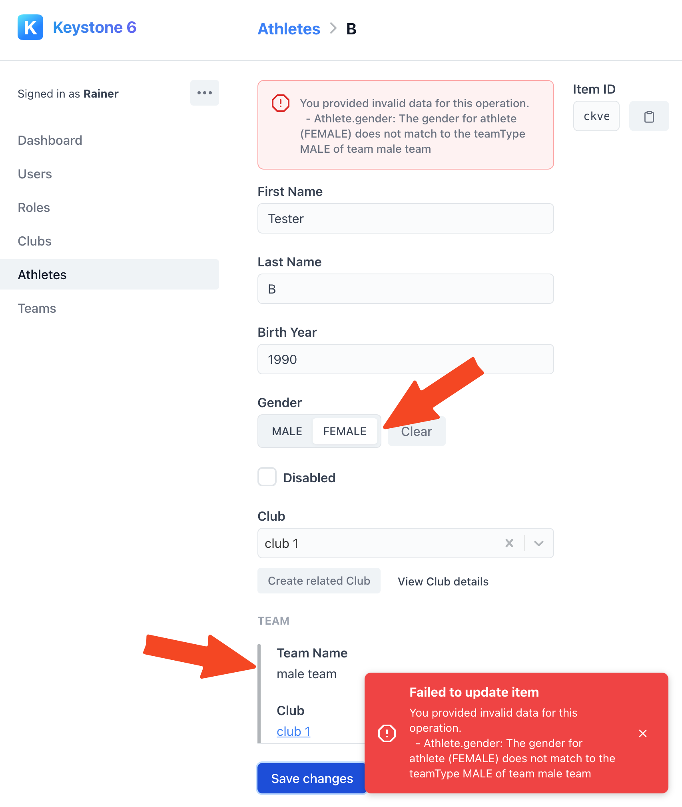

# Creating a keystone typescript app with next.js frontend using GraphQL

After watching the rather long [prisma day video](https://www.youtube.com/watch?v=Z-0_qlxNpm4&t=7689s) about keystone and 
partially watching Wes Bos' [Advanced React](https://advancedreact.com/) course, I wanted to take a stab at building a
non-trivial backend application using Keystone.

Especially I am interested in the performance characteristics for the query side of an application that I started building 
with Spring Boot and GraphQL. 

## The problem

The application we are going to build is going to feature multi-level relationships and lots of queries.

The following questions are of specific interest

* how to get performant master/detail queries with projections (n+1 problem)
* how to protect certain endpoints/queries based on user roles / authorities

Lets start with the data model:


We will be building a sports scoring application for Athletics where athletes can either participate individually or as teams. 

Every athlete will also belong to a club. I purposefully kept out the scoring part for now to keep things simple.

## Initial setup

Both frameworks come with their own project generators to get moving quickly.

We will be running both generators and finally merge the result of the 2 generated projects together

```bash
yarn create next-app --typescript frontend
```

and the keystone app

```bash
yarn create keystone-app
```

We will slightly tweak the `package.json` to contain tasks for both projects: 
```json
"scripts": {
    "dev": "keystone-next dev",
    "start": "keystone-next start",
    "build": "keystone-next build",
    "lint": "next lint",
    "site:dev": "next dev -p 8000",
    "site:build": "next build",
    "site:start": "next start -p 8000",
    "migrate": "keystone-next prisma migrate deploy",
    "format": "prettier --write \"**/*.ts\"",
    "postinstall": "keystone-next postinstall"
  },
```

The tasks `dev`, `start` and `build` were created by `keystone` and we renamed the next tasks as `site:dev`, `site:build` and `site:start`.

In addition we switch to `yarn2`

```bash
yarn set version berry
yarn set version latest
```

Sadly, keystone does not yet work properly with PNP so we stick with `node-modules` for now

```yaml
# .yarnrc.yml
yarnPath: .yarn/releases/yarn-3.0.2.cjs
nodeLinker: node-modules
```

Finally we need to run `yarn install` to install all dependencies using `yarn2`.

So lets start up both servers and see what we got:

```bash
shell1: yarn dev
shell2: yarn site:start
```

Starting up keystone on http://localhost:3000 produces the following create user screen


After signing up our admin user we see the generated keystone lists.


The next.js server shows the default empty next js app screen on http://localhost:8000/ 


Finally, we match up the repo with https://github.com/keystonejs/prisma-day-2021-workshop.

## Create the data model

Since we dont want to work with blog content, we will update the `keystone.ts` data model to match what we need:

### User

The user is slightly modified from the auth version from Wes Bos` Advanced react course:
https://github.com/wesbos/Advanced-React/blob/master/finished-application/backend/schemas/User.ts

```typescript

export const User = list({
  access: {
    operation: {
      create: () => true,
    },
    filter: {
      query: () => true,
      update: rules.canManageUserList,
      delete: rules.canManageUserList,
    },
  },
  ui: {
    hideCreate: context => !permissions.canManageUsers(context),
    hideDelete: context => !permissions.canManageUsers(context),
    itemView: {
      defaultFieldMode: context =>
        permissions.canManageUsers(context) ? 'edit' : 'hidden',
    },
    listView: {
      defaultFieldMode: context =>
        permissions.canManageUsers(context) ? 'read' : 'hidden',
    },
  },
  fields: {
    name: text({
      ui: {
        itemView: { fieldMode: fieldModes.editSelfOrRead },
      },
    }),
    email: text({
      isIndexed: 'unique',
      validation: {
        isRequired: true,
      },
      access: {
        read: rules.canManageUser,
      },
      ui: {
        itemView: { fieldMode: fieldModes.editSelfOrHidden },
      },
    }),
    password: password({
      validation: {
        isRequired: true,
      },
      ui: {
        itemView: { fieldMode: fieldModes.editSelfOrHidden },
      },
    }),
    role: relationship({
      ref: 'Role.users',
      access: permissions.canManageUsers,
    }),
    club: relationship({ ref: 'Club.managerUser' }),
  },
})

export const Role = list({
  access: {
    filter: {
      delete: permissions.canManageUsers,
      query: permissions.canManageUsers,
      update: permissions.canManageUsers,
    },
  },
  ui: {
    isHidden: context => !permissions.canManageUsers(context),
  },
  fields: {
    name: text(),
    canManageClubs: checkbox({ defaultValue: false }),
    canManageUsers: checkbox({ defaultValue: false }),
    canReadAllAthletes: checkbox({ defaultValue: false }),
    canWriteAllAthletes: checkbox({ defaultValue: false }),
    canReadOwnClubAthletes: checkbox({ defaultValue: false }),
    canWriteOwnClubAthletes: checkbox({ defaultValue: false }),
    canEnterScores: checkbox({ defaultValue: false }),
    canEnterScoresWhenDone: checkbox({ defaultValue: false }),
    canManageContent: checkbox({ defaultValue: false }),
    users: relationship({ ref: 'User.role', many: true }),
  },
})
```

Note that when you first create the initial user it is useful to comment the `access` portion out for both `User` and `Group` in order to allow setting
your admin user the correct admin role.

This can also be automated but for the first run this is good enough.

### Club
```typescript
export const Club = list({
  ui: {
    labelField: 'clubName',
  },
  fields: {
    clubName: text({
      db: { isNullable: false },
      validation: { isRequired: true },
    }),
    clubNumber: integer({ isOrderable: true, isIndexed: 'unique' }),
    
    athletes: relationship({
      ref: 'Athlete.club',
      many: true,
      ui: {
        displayMode: 'cards',
        cardFields: ['lastName', 'firstName', 'birthYear'],
        linkToItem: true,
        inlineConnect: true,
      },
    }),
  },
})
```

Keystone offers quite nice data types to generate a reasonable admin ui right out of the box.

### Athlete

The athlete is more of the same, the only difference is that we also add change tracking fields which we will touch upon later.

```typescript
export const Athlete = list({
  fields: {
    firstName: text({
      db: { isNullable: false },
      validation: { isRequired: true },
    }),
    lastName: text({
      db: { isNullable: false },
      validation: { isRequired: true },
    }),
    birthYear: integer({
      isOrderable: true,
      validation: { isRequired: true, min: 1900, max: 2050 },
    }),
    gender: select({
      options: [
        { label: 'MALE', value: 'MALE' },
        { label: 'FEMALE', value: 'FEMALE' },
      ],
      ui: {
        displayMode: 'segmented-control',
      },
    }),
    disabled: checkbox({ defaultValue: false }),
    club: relationship({
      ref: 'Club.athletes',
      ui: {
        displayMode: 'select',
      },
    }),
    team: relationship({
      ref: 'Team.athletes',
      ui: {
        displayMode: 'select',
      },
    }),
    version: integer({ db: { isNullable: false }, defaultValue: 0 }),
    createdBy: text({
      ui: {
        itemView: { fieldMode: 'hidden' },
        createView: { fieldMode: 'hidden' },
      },
    }),
    lastModifiedBy: text({
      ui: {
        itemView: { fieldMode: 'hidden' },
        createView: { fieldMode: 'hidden' },
      },
    }),
    createdDate: timestamp({
      defaultValue: { kind: 'now' },
      ui: {
        itemView: { fieldMode: 'hidden' },
        createView: { fieldMode: 'hidden' },
      },
    }),
    lastModifiedDate: timestamp({
      defaultValue: { kind: 'now' },
      db: { updatedAt: true },
      ui: {
        itemView: { fieldMode: 'hidden' },
        createView: { fieldMode: 'hidden' },
      },
    }),
  },
})
```

### Team

The team looks very much like the club.

```typescript
export const Team = list({
  ui: {
    labelField: 'teamName',
  },
  fields: {
    teamName: text({
      db: { isNullable: false },
      validation: { isRequired: true },
    }),
    teamType: select({
      db: { isNullable: false },
      validation: { isRequired: true },
      options: [
        { label: 'MALE', value: 'MALE' },
        { label: 'FEMALE', value: 'FEMALE' },
        { label: 'MIXED', value: 'MIXED' },
      ],
    }),
    club: relationship({
      ref: 'Club.teams',
      ui: {
        displayMode: 'select',
      },
    }),
    athletes: relationship({
      ref: 'Athlete.team',
      many: true,
      ui: {
        displayMode: 'cards',
        cardFields: ['lastName', 'firstName', 'birthYear'],
        linkToItem: true,
        inlineConnect: true,
      },
    }),
    teams: relationship({
      ref: 'Team.club',
      many: true,
      ui: {
        displayMode: 'cards',
        cardFields: ['teamName'],
        linkToItem: true,
        inlineConnect: true,
      },
    }),
  },
})
```

## Testing the performance of the queries

We obviously want to know whether keystone does a credible job for our backend, one of the main aspects is
performance of the queries.
When executing the following GraphQL query 
```graphql
query ClubsWithAthletes {
  clubs {
    clubName
    street
    zip
    city
    country
    external
    athletes {
      firstName
      lastName
      birthYear
      createdBy
    }
  }
}
```
these SQL statements are executed on the database:
```sql
prisma:query SELECT 1
prisma:query SELECT `main`.`Club`.`id`, `main`.`Club`.`clubName`, `main`.`Club`.`clubNumber`, `main`.`Club`.`contactEmail`, `main`.`Club`.`addressName`, `main`.`Club`.`street`, `main`.`Club`.`zip`, `main`.`Club`.`city`, `main`.`Club`.`country`, `main`.`Club`.`external`, `main`.`Club`.`managerUser` FROM `main`.`Club` WHERE 1=1 LIMIT ? OFFSET ?
prisma:query SELECT `main`.`Athlete`.`id`, `main`.`Athlete`.`firstName`, `main`.`Athlete`.`lastName`, `main`.`Athlete`.`birthYear`, `main`.`Athlete`.`gender`, `main`.`Athlete`.`disabled`, `main`.`Athlete`.`club`, `main`.`Athlete`.`version`, `main`.`Athlete`.`createdBy`, `main`.`Athlete`.`lastModifiedBy`, `main`.`Athlete`.`createdDate`, `main`.`Athlete`.`lastModifiedDate` FROM `main`.`Athlete` WHERE (`main`.`Athlete`.`id`) IN (SELECT `t0`.`id` FROM `main`.`Athlete` AS `t0` INNER JOIN `main`.`Club` AS `j0` ON (`j0`.`id`) = (`t0`.`club`) WHERE (`j0`.`id` = ? AND `t0`.`id` IS NOT NULL)) LIMIT ? OFFSET ?
prisma:query SELECT `main`.`Athlete`.`id`, `main`.`Athlete`.`firstName`, `main`.`Athlete`.`lastName`, `main`.`Athlete`.`birthYear`, `main`.`Athlete`.`gender`, `main`.`Athlete`.`disabled`, `main`.`Athlete`.`club`, `main`.`Athlete`.`version`, `main`.`Athlete`.`createdBy`, `main`.`Athlete`.`lastModifiedBy`, `main`.`Athlete`.`createdDate`, `main`.`Athlete`.`lastModifiedDate` FROM `main`.`Athlete` WHERE (`main`.`Athlete`.`id`) IN (SELECT `t0`.`id` FROM `main`.`Athlete` AS `t0` INNER JOIN `main`.`Club` AS `j0` ON (`j0`.`id`) = (`t0`.`club`) WHERE (`j0`.`id` = ? AND `t0`.`id` IS NOT NULL)) LIMIT ? OFFSET ?
```

Lets unpack this a bit: 

### Query 1
```sql
SELECT 
  `main`.`Club`.`id`, `main`.`Club`.`clubName`, 
  `main`.`Club`.`clubNumber`, `main`.`Club`.`contactEmail`, 
  `main`.`Club`.`addressName`, `main`.`Club`.`street`, 
  `main`.`Club`.`zip`, `main`.`Club`.`city`, `main`.`Club`.`country`, 
  `main`.`Club`.`external`, `main`.`Club`.`managerUser` 
FROM `main`.`Club` 
WHERE 1=1 
LIMIT ? OFFSET ?
```
This basically simply queries all clubs with the *all* columns in the table (rather than only querying the fields we asked for in the GraphqL query). 
While this is a bit sad (or a lost opportunity) other solutions usually also suffer from this (e.g. Spring-graphql together with Spring Data).

### Query 2
```sql
SELECT 
  `main`.`Athlete`.`id`, `main`.`Athlete`.`firstName`, `main`.`Athlete`.`lastName`, 
  `main`.`Athlete`.`birthYear`, `main`.`Athlete`.`gender`, `main`.`Athlete`.`disabled`, 
  `main`.`Athlete`.`club`, `main`.`Athlete`.`version`, `main`.`Athlete`.`createdBy`, 
  `main`.`Athlete`.`lastModifiedBy`, `main`.`Athlete`.`createdDate`, 
  `main`.`Athlete`.`lastModifiedDate` 
FROM `main`.`Athlete` 
WHERE (`main`.`Athlete`.`id`) IN 
  (
    SELECT `t0`.`id` 
    FROM `main`.`Athlete` AS `t0` 
      INNER JOIN `main`.`Club` AS `j0` ON (`j0`.`id`) = (`t0`.`club`) 
    WHERE (`j0`.`id` = ? AND `t0`.`id` IS NOT NULL)
  ) LIMIT ? OFFSET ?
```

Here it lists all athletes for a specific club. This is quite a naive approach since in theory you could query all 
athletes which have their club id within the list of ids coming from query 1.

However, from the standpoint of proper paging athletes this approach makes more sense. 
Lets imagine that we were to query only 3 athletes from each club

```graphql
query ExampleQuery($take: Int) {
  clubs {
     athletes(take: 3) {
      firstName
     }
  }
```
Then the "optimized" approach would lead to only return 3 athletes of the first club rather than 
returning 3 of each club.

### Query 3 
```sql
SELECT 
  `main`.`Athlete`.`id`, `main`.`Athlete`.`firstName`, `main`.`Athlete`.`lastName`, 
  `main`.`Athlete`.`birthYear`, `main`.`Athlete`.`gender`, `main`.`Athlete`.`disabled`, 
  `main`.`Athlete`.`club`, `main`.`Athlete`.`version`, `main`.`Athlete`.`createdBy`, 
  `main`.`Athlete`.`lastModifiedBy`, `main`.`Athlete`.`createdDate`, `main`.`Athlete`.`lastModifiedDate` 
FROM `main`.`Athlete` 
WHERE 
  (`main`.`Athlete`.`id`) IN 
    (
      SELECT `t0`.`id` 
      FROM `main`.`Athlete` AS `t0` 
        INNER JOIN `main`.`Club` AS `j0` ON (`j0`.`id`) = (`t0`.`club`) 
      WHERE (`j0`.`id` = ? AND `t0`.`id` IS NOT NULL )
    ) 
LIMIT ? OFFSET ?
```
This is obviously the same query as the previous one. 

One thing to comment on is that the `INNER JOIN` on the `club` (within the inner `SELECT`) is a bit useless.
Again this seems like the default implementation of keystone JS is playing it safe (as you might use a different linking criterium that is not mapped into the athlete). However, given that this usecase is the default for many-to-one relationships, it would have been nice 
if the implementation would have used the variant without the inner join.

However, given that most databases are quite smart, in reality this probably won't have any measurable effect.

To summarize, Keystone has a reasonable implementation for `1:many` relationships which will produce a lesser 
form of the `n+1` problem. This will probably become more pronounced as we increase the 
complexity of the queries adding more levels.

Whether this will create performance problems in practice will depend on your usecase.

## Adding security

In order to properly configure security, we have to tweak the `keystone.ts` configuration.

```typescript

import { config } from '@keystone-next/keystone'

// Look in the schema file for how we define our lists, and how users interact with them through graphql or the Admin UI
import { lists } from './schema'

// Keystone auth is configured separately - check out the basic auth setup we are importing from our auth file.
import { withAuth, session } from './auth'

export default withAuth(
  // Using the config function helps typescript guide you to the available options.
  config({
    // the db sets the database provider - we're using sqlite for the fastest startup experience
    db: {
      provider: 'sqlite',
      url: 'file:./keystone.db',
      enableLogging: true,
    },
    // This config allows us to set up features of the Admin UI https://keystonejs.com/docs/apis/config#ui
    ui: {
      // For our starter, we check that someone has session data before letting them see the Admin UI.
      isAccessAllowed: context => !!context.session?.data,
    },
    lists,
    session,
  })
)
```

We have moved our `lists` config into an own file and most of the authentication config is to be found in `./auth`.

```typescript
let sessionSecret = process.env.SESSION_SECRET

// Here is a best practice! It's fine to not have provided a session secret in dev,
// however it should always be there in production.
if (!sessionSecret) {
  if (process.env.NODE_ENV === 'production') {
    throw new Error(
      'The SESSION_SECRET environment variable must be set in production'
    )
  } else {
    sessionSecret = '-- DEV COOKIE SECRET; CHANGE ME --'
  }
}

// Here we define how auth relates to our schemas.
// What we are saying here is that we want to use the list `User`, and to log in
// we will need their email and password.
const { withAuth } = createAuth({
  listKey: 'User',
  identityField: 'email',
  sessionData: `id name email role { ${permissionsList.join(' ')} }`,
  secretField: 'password',
  initFirstItem: {
    // If there are no items in the database, keystone will ask you to create
    // a new user, filling in these fields.
    fields: ['name', 'email', 'password'],
  },
})

// This defines how long people will remain logged in for.
// This will get refreshed when they log back in.
let sessionMaxAge = 60 * 60 * 24 * 30 // 30 days

// This defines how sessions should work. For more details, check out: https://keystonejs.com/docs/apis/session#session-api
const sessionConfig = {
  maxAge: sessionMaxAge,
  secret: sessionSecret!,
}
const session = statelessSessions(sessionConfig)

export { withAuth, session }
```

Here we configure the `User` list to contain all user logins. The important section is 

```typescript
  sessionData: `id name email role { ${permissionsList.join(' ')} }`,
```

where `permissionsList` is to be found in `./keystone/schema/fields.ts`. 
Here we define all the fields we want to have in our `Role` table
which basically configures all the permissions available in our system. 

A good practice is to add indiviual permissions to read individual 
elements such as `canReadOwnClubAthletes` vs. `canReadAllAthletes`.
This gives us the ability to add fine-grained permission controls.

```typescript
import { checkbox } from '@keystone-next/keystone/fields'

export const permissionFields = {
  canManageClubs: checkbox({ defaultValue: false }),
  canManageUsers: checkbox({ defaultValue: false }),
  canReadAllAthletes: checkbox({ defaultValue: false }),
  canWriteAllAthletes: checkbox({ defaultValue: false }),
  canReadOwnClubAthletes: checkbox({ defaultValue: false }),
  canWriteOwnClubAthletes: checkbox({ defaultValue: false }),
  canEnterScores: checkbox({ defaultValue: false }),
  canEnterScoresWhenDone: checkbox({ defaultValue: false }),
  canManageContent: checkbox({ defaultValue: false }),
}

export type Permission = keyof typeof permissionFields

export const permissionsList: Permission[] = Object.keys(
  permissionFields
) as Permission[]
```

If you start up the system first time and you don't have any users in the `User` table, 
you need to comment out the `access` portion in the `user.ts` file for both
`User` and `Role` in order to generate an "admin" role that can do everything 
and is assigned to your newly created user.

## Adding business logic

### Limit access to `Club`s

In order to properly protect the `Clubs` we will only allow signed in users with the correct permissions
to access / update the data.

```typescript
function filterForAuthClub(args: { session: SessionContext<any> }) {
  if (!isSignedIn(args)) {
    return false
  }
  return permissions.canManageClubs(args)
}

export const Club = list({
  access: {
    filter: {
      delete: args => filterForAuthClub(args),
      query: args => filterForAuthClub(args),
      update: args => filterForAuthClub(args),
    },
  },
``` 

Note that we could even return an additional filter that allows us to limit 
`query`, `update` and `delete` to a subset of `Clubs`. That might be useful e.g. if a 
specific user only has the ability to manage a certain club id.

In that case the `filterForAuth` method would look like this: 
```typescript
function filterForAuthClub(args: { session: SessionContext<any> }) {
  if (!isSignedIn(args)) {
    return false
  }
  if (permissions.canManageClubs(args)) {
    return true
  }
  const managedClubId = args.session.data.club?.id
  if (!managedClubId) {
    return false
  }
  return { id: { equals: managedClubId } }
}
```

Here I am quite impressed with the possibilities that keystone provides. 
In addition, we can do additional tasks via the 
[hooks api](https://keystonejs.com/docs/apis/hooks).

### Ensuring Athletes in `Team` have the matching gender

One of our requirements is that all athletes in a team must match the teams `teamType`.
So we cannot have male athletes in a female team.

To do this we need to tackle this on multiple fronts. 

* When an athlete is created and assigned to a team
* When an athlete changes teams
* When an update to an athlete is made that changes the `gender`
* When a teams `teamType` is updated, we need to check all team members

Lets start on the `Athlete` side:

```typescript
export const Athlete = list({
    ...
    hooks: {
        validateInput: async args => {
          const { resolvedData, item, context } = args
          const newGender = resolvedData.gender ?? item?.gender
          const teamId = resolvedData.team?.connect?.id ?? item?.teamId
        
          if (newGender && teamId) {
            const team = await context.db.Team.findOne({
              where: { id: teamId },
            })
            if (!teamTypeMatchesGender(team.teamType, newGender)) {
              args.addValidationError(
                `The gender for athlete (${newGender}) does not match to the teamType ${team.teamType} of team ${team.teamName}`
              )
            }
          }
        },
      },
      ...
}

export function teamTypeMatchesGender(teamType: string, gender: string) {
  if (teamType === gender) {
    return true
  }
  return teamType === 'MIXED'
}
```

If we now try to save a previously female athlete that is in a female team and change the `gender` to `male` we get
the following error:


The same happens if we change the team to an all male team:



## Limiting query complexity

