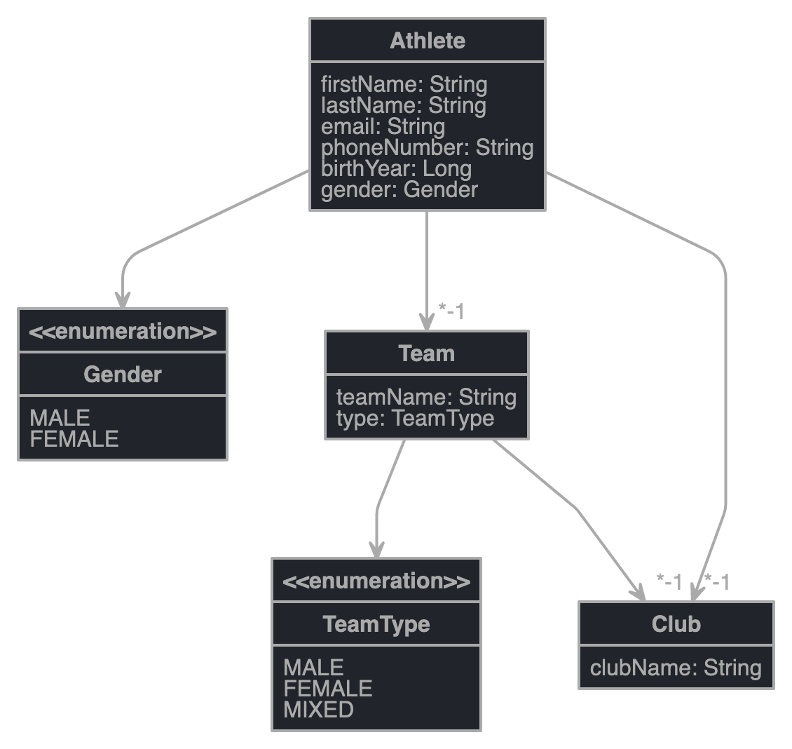
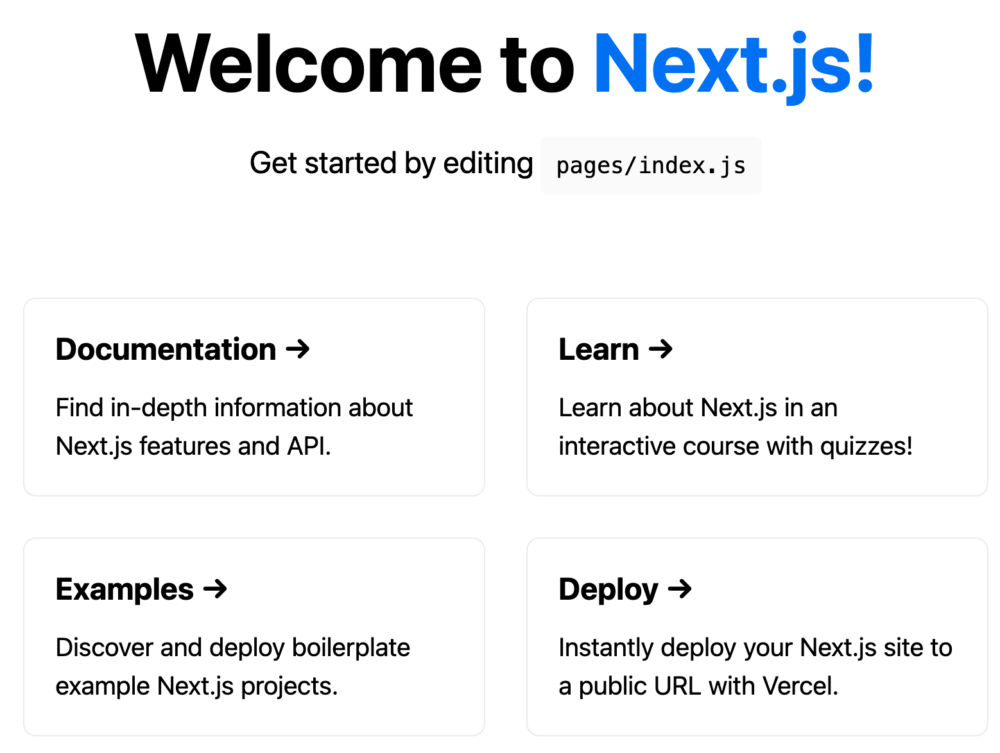

# Creating a keystone typescript app with next.js frontend using GraphQL

After watching the rather long [prisma day video](https://www.youtube.com/watch?v=Z-0_qlxNpm4&t=7689s) about keystone and 
partially watching Wes Bos' [Advanced React](https://advancedreact.com/) course, I wanted to take a stab at building a
non-trivial backend application using Keystone.

Especially I am interested in the performance characteristics for the query side of an application that I started building 
with Spring Boot and GraphQL. 

## The problem

The application we are going to build is going to feature multi-level relationships and lots of queries.

The following questions are of specific interest

* how to get performant master/detail queries with projections (n+1 problem)
* how to protect certain endpoints/queries based on user roles / authorities

Lets start with the data model:


We will be building a sports scoring application for Athletics where athletes can either participate individually or as teams. 

Every athlete will also belong to a club. I purposefully kept out the scoring part for now to keep things simple.

## Initial setup

Both frameworks come with their own project generators to get moving quickly.

We will be running both generators and finally merge the result of the 2 generated projects together

```bash
yarn create next-app --typescript frontend
```

and the keystone app

```bash
yarn create keystone-app
```

We will slightly tweak the `package.json` to contain tasks for both projects: 
```json
"scripts": {
    "dev": "keystone-next dev",
    "start": "keystone-next start",
    "build": "keystone-next build",
    "lint": "next lint",
    "site:dev": "next dev -p 8000",
    "site:build": "next build",
    "site:start": "next start -p 8000",
    "migrate": "keystone-next prisma migrate deploy",
    "format": "prettier --write \"**/*.ts\"",
    "postinstall": "keystone-next postinstall"
  },
```

The tasks `dev`, `start` and `build` were created by `keystone` and we renamed the next tasks as `site:dev`, `site:build` and `site:start`.

In addition we switch to `yarn2`

```bash
yarn set version berry
yarn set version latest
```

Sadly, keystone does not yet work properly with PNP so we stick with `node-modules` for now

```yaml
# .yarnrc.yml
yarnPath: .yarn/releases/yarn-3.0.2.cjs
nodeLinker: node-modules
```

Finally we need to run `yarn install` to install all dependencies using `yarn2`.

So lets start up both servers and see what we got:

```bash
shell1: yarn dev
shell2: yarn site:start
```

Starting up keystone on http://localhost:3000 produces the following create user screen


And next shows the default empty next js app screen on http://localhost:8000/ 



Finally, we match up the repo with https://github.com/keystonejs/prisma-day-2021-workshop.

